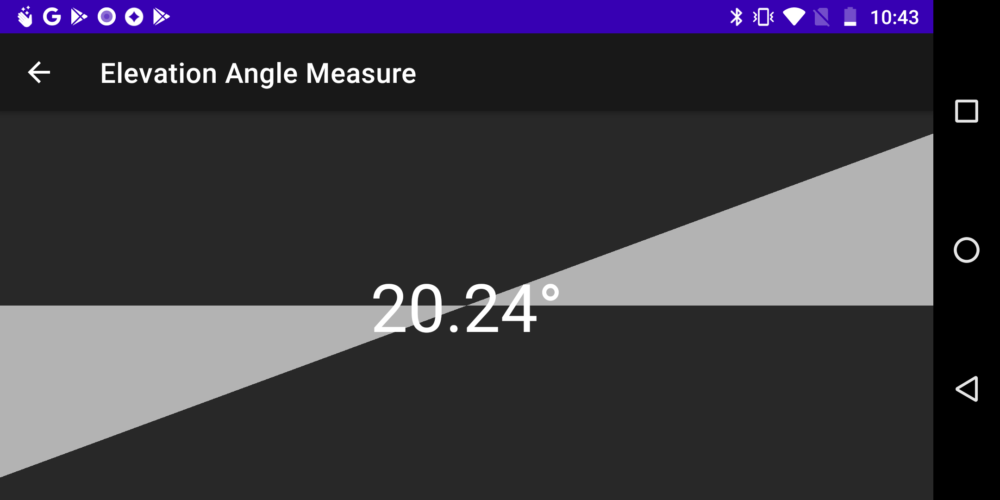

# DIY Measure Kit

Android app for measurement.

## Overview

This app measures:

- length(distance) and
- angle.

## Distance Measure

_Distance Measure_ measures the distance traveled by the phone.

## Elevation Angle Measure

_Elevation Angle Measure_ measures the angle from the horizontal.

